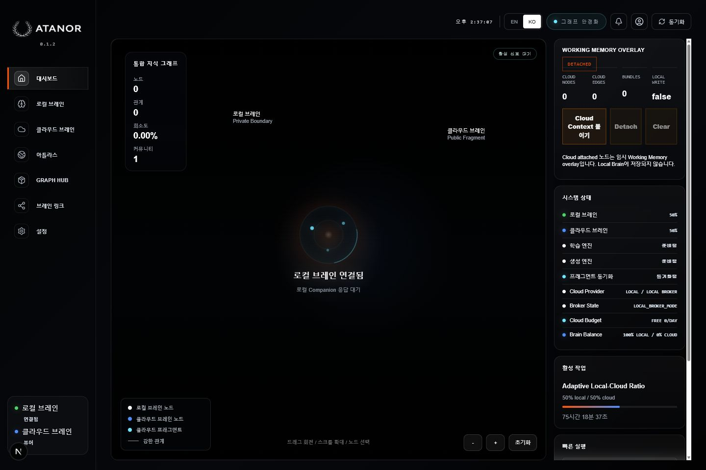
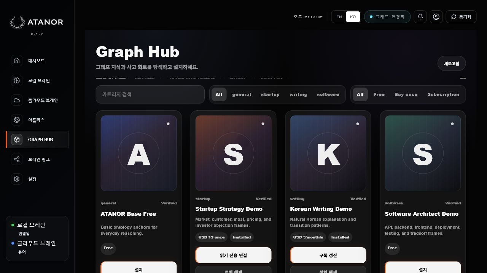

# ATANOR

**A graph-native, local-first AI architecture for transparent memory, verifiable reasoning, and installable knowledge.**

[](LICENSE)


ATANOR is an experimental AI system that treats knowledge as a living graph instead of hiding it inside opaque model weights. It separates private local memory from public cloud fragments, renders the active reasoning surface, and lets graph cartridges attach read-only into working memory.



## Table Of Contents

- [Why ATANOR Exists](#why-atanor-exists)
- [What ATANOR Does Today](#what-atanor-does-today)
- [How It Works](#how-it-works)
- [Product Screenshots](#product-screenshots)
- [Architecture In One Picture](#architecture-in-one-picture)
- [Quickstart](#quickstart)
- [Developer Commands](#developer-commands)
- [Use Cases](#use-cases)
- [Roadmap](#roadmap)
- [FAQ](#faq)
- [Honest Boundaries](#honest-boundaries)

## Why ATANOR Exists

Most AI products ask users to trust a remote black box. ATANOR explores a different direction:

- **Local Brain:** private memory stays on the user's machine.
- **Cloud Brain:** public knowledge grows as content-addressed graph fragments.
- **Graph Hub:** useful graph packs can be installed, audited, and attached read-only.
- **Surface Brain:** answer quality and repair rules become reviewable artifacts.
- **CORTEX-G2 / Q-Cortex:** planning, salience, and optimization are explicit subsystems.
- **Proof-first development:** core claims are backed by tests and proof artifacts.

The goal is not to pretend that a small alpha system is a frontier LLM. The goal is to build the missing architecture around AI: memory that can be inspected, provenance that can be audited, and knowledge packages that can move without surrendering private data.

## What ATANOR Does Today

ATANOR is already more than a static concept document. The current repository contains a working local web lab, API runtime, proof artifacts, and a cartridge-style graph package system.

| Capability | Current state | What to inspect |
| --- | --- | --- |
| Local Brain | Local graph memory, retrieval, answer synthesis, proof fixtures | `packages/rag_engine`, `packages/base_brain` |
| Cloud Brain | Public semantic fragment store and cloud attachment proofs | `packages/cloud_brain`, `data/cloud_brain/proofs` |
| Brain Graph | Tab-aware graph projection for local, cloud, and unified views | `packages/brain_graph`, `apps/web/app/page.tsx` |
| Graph Hub | Catalog, install, entitlement, sandbox attach, export, audit | `packages/graph_hub`, `data/graph_hub/catalog` |
| Atlas | Privacy-safe regional relay visualization for future contributor nodes | `apps/web/app/AtlasGlobe3D.tsx`, `docs/ATANOR_ATLAS.md` |
| Surface Brain | Reviewable repair rules and answer-quality feedback loops | `packages/surface_brain`, `packages/answer_quality` |
| Q-Cortex / CORTEX-G2 | Planning, salience, activation, predictive loop prototypes | `packages/q_cortex`, `packages/cortex_g2` |
| Desktop direction | Tauri sidecar and Windows distribution notes | `src-tauri`, `docs/DESKTOP_DISTRIBUTION_STRATEGY.md` |

## How It Works

ATANOR's workflow is designed around observable state instead of invisible prompt chains:

1. **Seed the graph:** documents, public fragments, or base packs become concepts, relations, evidence, and provenance.
2. **Keep private memory local:** Local Brain stores user/private graph state on the user's machine.
3. **Attach public context safely:** Cloud Brain fragments and Graph Hub cartridges attach into working memory without silently writing into Local Brain.
4. **Render the reasoning surface:** Brain Graph and the web workspace show which layer is active: local, cloud, unified, or cartridge.
5. **Answer with evidence:** retrieval and answer-quality services keep answer context tied to traceable graph artifacts.
6. **Repair through review:** Surface Brain turns failures and style corrections into reviewable repair candidates.
7. **Package knowledge:** Graph Hub exports graph cartridges so knowledge can move as auditable structure, not only as prompts.

This is the core difference: ATANOR does not only generate an answer. It builds and displays the memory surface that the answer came from.

## What Is In This Repository

| Layer | Purpose | Representative paths |
| --- | --- | --- |
| Web lab | Interactive ATANOR workspace, Graph Hub, Atlas, Cloud Brain panels | `apps/web` |
| API runtime | FastAPI routers for graph, memory, cloud, repair, quality, Graph Hub | `apps/api` |
| Local Brain | Local graph memory, retrieval, synthesis, alpha services | `packages/rag_engine`, `packages/knowledge_bakery` |
| Cloud Brain | Semantic growth, cloud-attached nodes, contributor fragments | `packages/cloud_brain` |
| Brain Graph | Tab-aware graph rendering and materialization | `packages/brain_graph` |
| Base Brain | Seed/base knowledge packs and zero-user answer proof | `packages/base_brain` |
| Graph Hub | Graph cartridge catalog, entitlement, install, attach, sandbox, audit | `packages/graph_hub` |
| Surface Brain | Production rule review, repair queue, discourse/style graph | `packages/surface_brain` |
| Q-Cortex | Planning, evidence, salience, and QUBO-style optimization | `packages/q_cortex` |
| CORTEX-G2 | Activation, dream loop, predictive engine, verbalization routing | `packages/cortex_g2` |
| Proofs | Public proof snapshots and sample catalog artifacts | `data/*/proofs`, `data/*/catalog` |
| Infra | Cloudflare and AWS broker prototypes | `infra` |

## Product Screenshots

### Graph-Native Workspace

The main workspace renders the active system as a navigable graph surface, with Local Brain, Cloud Brain, Atlas, Graph Hub, and control panels in one interface.


### Graph Hub

Graph Hub is not a prompt marketplace. It is a cartridge system for graph data: catalog, install, entitlement state, read-only attachment, export, and audit.



### Cloud Brain / Atlas

Cloud Brain and Atlas visualize public graph-fragment state without claiming private local memory as shared cloud intelligence.


## Architecture In One Picture

```text
Local documents / user input / public fragments
        |
        v
Harvest + DataGate
  clean, filter, deduplicate, gate
        |
        v
Ontology + Base Brain
  concepts, aliases, seed packs, surface packs
        |
        v
Local Brain                     Cloud Brain
private graph memory            public graph fragments
SQLite / local traces           semantic proof store
        |                       |
        +----------+------------+
                   v
Working Memory Overlay
temporary attachment, provenance, no silent local writes
                   |
                   v
Brain Graph Renderer + Graph Hub
tab-aware views, graph cartridges, audit trail
                   |
                   v
Surface Brain + Q-Cortex + CORTEX-G2
answer quality, repair review, salience, planning
```

Read the fuller technical overview in [docs/ARCHITECTURE.md](docs/ARCHITECTURE.md).

## Verified Alpha State

Current publication validation:

- `python -m pytest apps/api/tests packages/rag_engine/tests packages/cloud_brain/tests packages/seed_research/tests packages/cortex_g2/tests packages/q_cortex/tests packages/surface_brain/tests packages/answer_quality/tests packages/base_brain/tests packages/brain_graph/tests packages/graph_hub/tests -q`
- `npm --workspace apps/web run build`
- Browser smoke checks against the local ATANOR web workspace
- Secret/path scan over staged publication files

Key proof artifacts are committed under `data/*/proofs` and the sample Graph Hub catalog is committed under `data/graph_hub/catalog`.

## Quickstart

### Prerequisites

| Tool | Recommended version | Why it is needed |
| --- | --- | --- |
| Python | 3.11+ | FastAPI runtime and graph/proof packages |
| Node.js | 20+ | Next.js web workspace |
| npm | bundled with Node | workspace scripts |
| PowerShell | Windows default | commands below are written for Windows |

### Environment

Copy the example environment file if you want to use local overrides:

```powershell
Copy-Item .env.example .env
```

The public alpha paths are designed to run without committing external API secrets. If you connect external LLMs, brokers, or cloud services, keep those values in `.env` only.

### Install

```powershell
python -m venv .venv
.venv\Scripts\activate
pip install -r apps/api/requirements.txt
npm install
```

### Start The API

```powershell
python -m uvicorn app.main:app --host 127.0.0.1 --port 8500 --app-dir apps/api
```

### Start The Web Workspace

```powershell
npm --workspace apps/web run dev -- --hostname 127.0.0.1 --port 3022
```

Open:

```text
http://127.0.0.1:3022/?lang=ko
```

## Developer Commands

```powershell
# Run the web production build
npm --workspace apps/web run build

# Run the publication test suite used for this release snapshot
python -m pytest apps/api/tests packages/rag_engine/tests packages/cloud_brain/tests packages/seed_research/tests packages/cortex_g2/tests packages/q_cortex/tests packages/surface_brain/tests packages/answer_quality/tests packages/base_brain/tests packages/brain_graph/tests packages/graph_hub/tests -q

# Run both API and web with the root convenience script
npm run dev

# Build the desktop sidecar prototype
npm run desktop:sidecar
```

## Use Cases

ATANOR is useful for teams and builders exploring AI systems where memory, provenance, and user ownership matter:

- **Personal AI memory:** build an assistant whose private memory can be inspected, pruned, and repaired.
- **Knowledge products:** ship domain expertise as graph cartridges rather than static prompt packs.
- **Research workspaces:** visualize how local notes, public sources, and working context interact.
- **Answer-quality loops:** turn bad answers into reviewable repair artifacts instead of hidden prompt edits.
- **Privacy-preserving collaboration:** combine public graph fragments with private local context without collapsing the boundary.
- **Agent substrate experiments:** test planning, salience, activation, and repair loops against explicit graph state.

## Roadmap

| Track | Next direction |
| --- | --- |
| Local Brain | Better import flows, pruning controls, graph diffing, and user-facing memory editing |
| Graph Hub | Signed cartridges, stronger entitlement proofs, dependency metadata, and richer install UX |
| Cloud Brain | Contributor-node broker hardening, fragment reputation, cost controls, and remote proof sync |
| Atlas | Faster low-end rendering, relay status simulation, and clearer contributor privacy affordances |
| Surface Brain | Human review queue, rule rollback UI, style graph versioning, and repair metrics |
| Desktop | Tauri packaging, updater flow, Windows signing, and local sidecar reliability |
| Documentation | More screenshots, walkthrough videos, API reference, and cartridge authoring guide |

## FAQ

### Is ATANOR a new LLM?

No. ATANOR is an architecture around AI memory, retrieval, graph state, answer repair, and installable knowledge. It can work with models, but the core claim is about the substrate around the model.

### Does Cloud Brain upload my private memory?

No by default. The current architecture treats Cloud Brain as public graph fragments and contributor signals. Local Brain remains the private memory boundary.

### Is Graph Hub a prompt marketplace?

No. Graph Hub is a cartridge system for structured graph knowledge: catalog, install, attach, export, and audit.

### Is this production-ready?

Not yet. It is a public alpha research platform with working proofs, UI surfaces, and tests. The repo is public so the architecture can be inspected early.

### Where should contributors start?

Start with [CONTRIBUTING.md](CONTRIBUTING.md), then inspect [docs/ARCHITECTURE.md](docs/ARCHITECTURE.md), `data/*/proofs`, and the Graph Hub package under `packages/graph_hub`.

## Public Positioning

ATANOR is for people who believe AI needs more than bigger prompts:

- transparent memory instead of hidden state
- local ownership instead of default data surrender
- graph-native reasoning instead of one-shot text generation
- installable knowledge instead of prompt packs
- proof artifacts instead of hand-wavy architecture claims

See [docs/LAUNCH_KIT.md](docs/LAUNCH_KIT.md) for public launch copy, short posts, and messaging angles.

## Project Links

- Architecture: [docs/ARCHITECTURE.md](docs/ARCHITECTURE.md)
- Vision: [docs/VISION.md](docs/VISION.md)
- Launch copy: [docs/LAUNCH_KIT.md](docs/LAUNCH_KIT.md)
- Contributor guide: [CONTRIBUTING.md](CONTRIBUTING.md)
- Security notes: [SECURITY.md](SECURITY.md)
- Atlas notes: [docs/ATANOR_ATLAS.md](docs/ATANOR_ATLAS.md)
- Desktop strategy: [docs/DESKTOP_DISTRIBUTION_STRATEGY.md](docs/DESKTOP_DISTRIBUTION_STRATEGY.md)

## Long-Term Vision

ATANOR is a bet that personal AI will need a different substrate from today's chat-first products.

The long-term vision is a workstation-native intelligence system where:

- private memory can be owned, inspected, pruned, exported, and repaired by the user
- public knowledge can circulate as graph fragments rather than opaque model checkpoints
- useful expertise can ship as graph cartridges with auditable provenance
- reasoning paths can be displayed as active graph state, not only as polished text
- answer improvement can happen through reviewable repair loops instead of invisible prompt edits
- local and cloud intelligence can cooperate without erasing the privacy boundary

In that future, an AI system is not just a model endpoint. It is a living memory architecture: local where it must be private, networked where it can be public, and transparent enough to be corrected.

Read the public vision in [docs/VISION.md](docs/VISION.md).

## Honest Boundaries

ATANOR is an alpha research platform. It does **not** currently claim:

- GPT-level answer quality
- a global web-scale Cloud Brain
- production marketplace billing
- production DRM or legal commercial licensing
- perfect semantic parsing
- private data sharing by default
- external LLM/sLLM proof-path generation

Those boundaries matter. The architecture is interesting precisely because it keeps private and public knowledge separate, observable, and testable.

## License

See [LICENSE](LICENSE).
