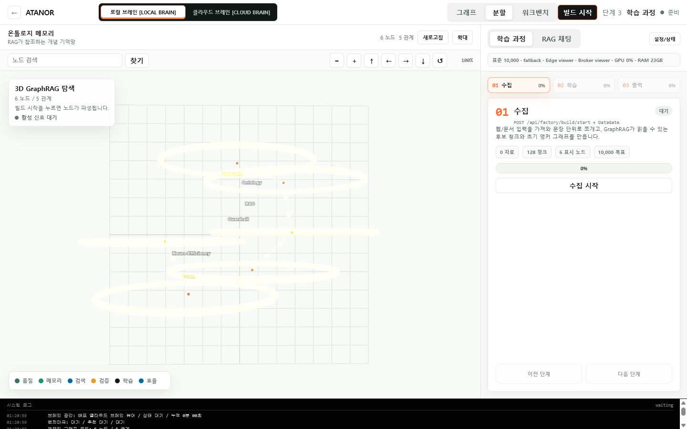
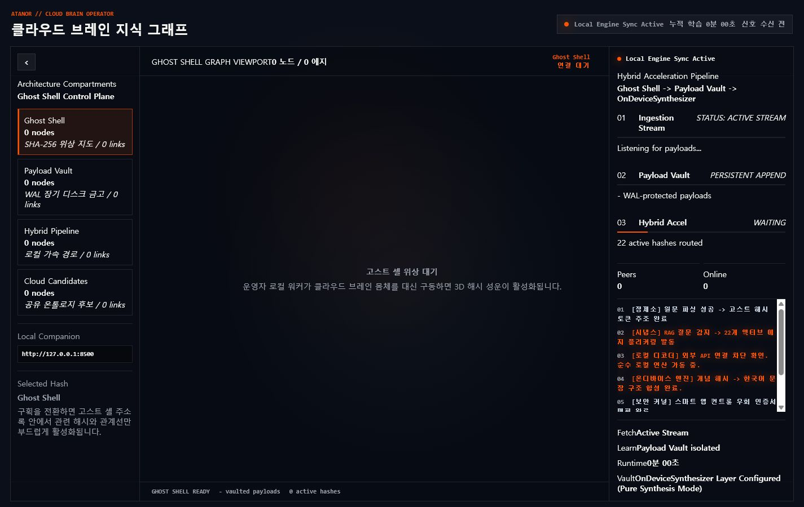
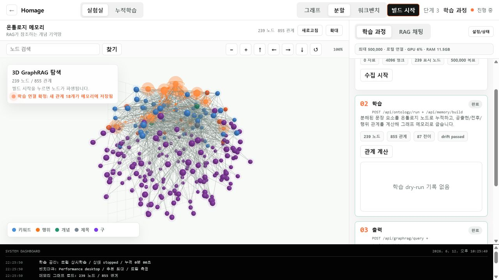
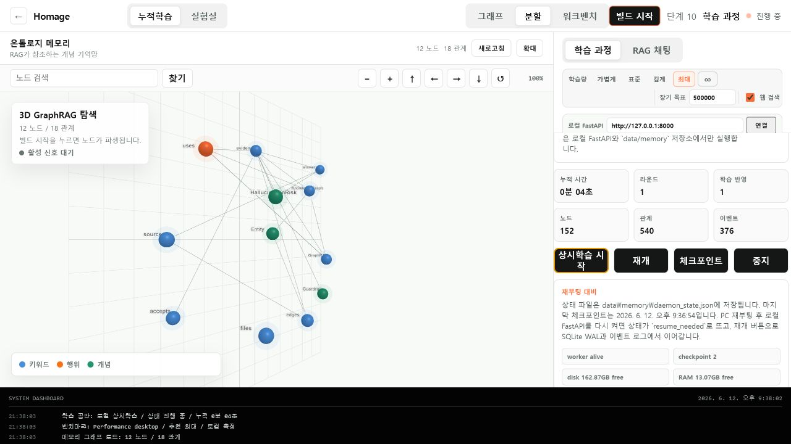

# ATANOR 1.0 Alpha

**Architecture for Transparent Anomy and Networked Ontology in Radical Engines**

**Local-first neuro-symbolic AI engine powered by the Homage Engine**

> ATANOR is a local-first AI OS where private memory stays on-device, while public knowledge grows through a contributor-powered Cloud Brain.

ATANOR is a local-first neuro-symbolic AI research engine for building,
inspecting, and evolving knowledge graphs on a workstation. It keeps factual
memory in traceable graph structures instead of hiding it inside opaque model
weights, then uses local retrieval and synthesis paths to produce answers from
inspectable context.

## 30-Second Summary

ATANOR separates private memory from public knowledge. Your Local Brain keeps
private documents, Payload Vault data, and chat traces on your own machine. The
Cloud Brain accepts only opt-in, public, content-addressed graph fragments
through a Cloudflare remote broker. Atlas visualizes this state honestly: real
broker status when connected, preview relay points until verified remote
contributors exist.

## Real vs Preview

| State | Item | Current release meaning |
| --- | --- | --- |
| REAL | Local FastAPI runtime | Backend APIs, memory endpoints, and tests run locally. |
| REAL | Cloudflare broker | Direct `/cloud/status` can report `remote_connected` and `active_single_peer` when configured. |
| REAL | Content-addressed public fragments | Submitted public fragments receive SHA-256 `content_hash` values and can be queried from KV. |
| REAL | Web build/tests | Current release checks include Python tests and `npm --workspace apps/web run build`. |
| PARTIAL | Contributor Node runtime | One active peer can register, poll, submit, and receive pending credit; multi-peer verification is not complete. |
| PARTIAL | Cumulative Cloud Brain learning | Fragment storage/query works; automatic reuse inside every RAG answer path still needs release proof. |
| PREVIEW | Global Atlas relay points | Overseas relay dots are anonymous preview regions unless real remote contributor aggregates are verified. |
| NOT YET | Production R2/D1/Queues | Cloudflare Worker currently supports KV fragment storage; R2/D1/Queues are future hardening paths. |
| NOT YET | Blockchain/token economy | Contribution credit is internal accounting only, not cryptocurrency or a financial asset. |
| NOT YET | Direct libp2p payload transport | Current release uses brokered Cloudflare coordination, not direct P2P payload transfer. |

## Naming Boundary

ATANOR is the external product and research brand. **Homage** remains the
original internal engine namespace where changing names would risk breaking
Alpha installations, data paths, tests, sidecar binaries, package imports,
Store identity, or legacy environment variables.

In practice:

- Public copy, page titles, README text, product UI, and new environment aliases
  should use **ATANOR**.
- Stable runtime paths such as `homage.db`, `homage-api`, `HOMAGE_*` fallback
  variables, and existing internal package names may remain until a tested
  migration plan exists.

[Live Lab Demo](https://atanor.vercel.app) | [Architecture](docs/CLOUD_BRAIN_ARCHITECTURE.md) | [Night Build Log](docs/night_log_0612.md)



## Philosophy

ATANOR is not an imitation of mainstream cloud LLM systems. It is an attempt to
build an independent, radical engine where knowledge, memory, retrieval, and
generation are structurally separated and visible.

The name defines the architecture:

| Letter | Pillar | Meaning |
| --- | --- | --- |
| A | Architecture | Replace black-box matrices with decoupled, hybrid structural memory. |
| T | Transparent | Build a 100% traceable, non-hallucinatory fact-based inference net. |
| A | Anomy | Preserve decentralized, air-gapped autonomy from mainstream cloud control. |
| N | Networked | Let 3D nodes prune, reinforce, and grow like biological synapses. |
| O | Ontology | Use multilingual concept-based knowledge graphs instead of raw string piles. |
| R | Radical Engines | Run a workstation-native inference engine that evolves with the user's data. |

Transparent Anomy is the operating principle: ATANOR prefers an inspectable,
air-gapped, locally owned graph over a remote black box. Every active node,
edge, payload hash, and retrieval step should be traceable enough for the user
to see why an answer was produced.

## Research Thesis

ATANOR starts from a simple question: can a personal workstation become useful
by storing knowledge as an evolving ontology graph, instead of forcing a model
to memorize everything inside opaque weights?

The target architecture separates sources without splitting the graph:

- **Local Brain:** private, persistent, hardware-adaptive source layer on the user's
  own machine.
- **Cloud Brain:** shared public source layer made of graph fragments that can be queried or copied
  without shipping a giant model around.

ATANOR does not maintain a separate Dual Graph. Local Brain and Cloud Brain are
source layers inside one Unified Ontology Graph. Unified Brain mode temporarily
joins local private memory and cloud public fragments inside Working Memory,
while preserving privacy boundaries and provenance.

The current Alpha does not claim to outperform modern LLMs. It is a transparent
prototype for testing whether graph lookup, synaptic edge weights, pruning,
lazy loading, and a future local syntax assembler can reduce the brute-force
generation needed for useful answers.

## What This Is

ATANOR is a research attempt to replace part of the brute-force LLM workflow
with a more explicit neuro-symbolic system:

- **Knowledge lives in a graph.** Documents, sentence parts, concepts, and
  relations become ontology nodes and weighted edges.
- **Generation is separated from memorization.** Alpha does not use an external
  LLM to hide weak reasoning behind polished prose. It exposes native graph
  retrieval and local synthesis paths so weak memory remains visible.
- **Learning is cumulative.** Repeated relations potentiate, stale edges decay,
  and pruning keeps local storage from growing without bound.
- **Hardware adapts the workload.** The backend detects RAM/VRAM tiers and
  clamps graph loading limits before queries touch SQLite.
- **Cloud Brain is a graph-fragment layer, not an LLM wrapper.** Shared/public
  knowledge is designed to move as signed graph fragments while private memory
  remains local.

The long-term vision is a workstation-scale AI engine that uses time, local
storage, and graph structure to compensate for not having a massive cloud model
behind every answer.

## Native Alpha Generation Honesty

ATANOR 1.0 Alpha intentionally does **not** make weak output look smart through
canned replies, external LLMs, pretrained local models, or template fallbacks.
If the native graph-token decoder produces broken, repetitive, or ugly text,
the UI keeps that raw output visible and attaches diagnostics such as loop
risk, repeated n-grams, source cluster coherence, and trace-save state.

Research rules for this Alpha:

- No external LLM answer generation.
- No pretrained sLLM, Ollama, llama.cpp, GGUF, or commercial/open LLM fallback.
- No hardcoded identity answer for "who are you" or ATANOR questions.
- Self identity must be learned by ingesting ATANOR documentation as
  `self_corpus` through DataGate, Ontology Forge, Knowledge Bakery, Ghost Shell,
  Payload Vault, GraphRAG, and the native graph-token decoder.
- Cloud Brain fragments may provide temporary evidence only; they must not
  provide the final answer text.
- Bad generations are stored as local training traces in
  `data/memory/generation_traces.jsonl`.
- User-approved corrections are stored as native training data in
  `data/memory/corrections.jsonl`.

## Screenshots

### Lab Workspace

The main lab view focuses on a 3D GraphRAG memory map and a right-side process
panel for collection, learning, and output.


### Cloud Brain Monitoring

Cloud Brain monitoring is now folded into the main ATANOR interface. Real
long-running workers run next to local FastAPI or a future desktop sidecar.



### Learning Edge Signals

Learning signals are visualized only when a real graph update or activation
event exists. The goal is to show what the engine is actually doing, not a
decorative animation.



### Local Daemon

The Cloud Brain worker watches local input, checkpoints memory, and survives
reboot through SQLite WAL plus daemon state files.



More UI verification screenshots are available in [docs/screenshots](docs/screenshots).

## Three-Step Flow

ATANOR is intentionally organized around three visible stages:

| Stage | Purpose | What the UI should reveal |
| --- | --- | --- |
| 1. Collect | Ingest web/local text, split sentences, filter noisy inputs | source count, chunks, DataGate pass/fail |
| 2. Learn | Build ontology concepts, calculate relation weights, checkpoint memory | new nodes, reinforced edges, pruning/decay |
| 3. Output | Retrieve active graph context and attempt a native answer | activated nodes, confidence, evidence/graph path |

This is why the lab view shows the graph and the process panel together. When a
node or edge lights up, it should correspond to an actual retrieval, insertion,
or learning event rather than a decorative animation.

## Architecture

```text
User question / local document
        |
        v
Harvest + DataGate
  collect, clean, filter, deduplicate
        |
        v
Ontology Forge
  contextual entity resolution
  UUID concept nodes
  concept_id -> concept_id edges
        |
        v
Knowledge Bakery / Local Brain
  SQLite WAL
  token transitions
  relation stats
  synaptic weights
  checkpointed daemon state
        |
        v
Ghost Shell + Payload Vault
  SHA-256 topology hashes
  disk-bound raw payloads
  lazy payload resolution
        |
        v
GraphRAG + Local Synthesis
  lazy subgraph retrieval
  active-node signals
  local context synthesis
        |
        v
Guard / Drift / Stability
  evidence checks
  graph health
  resource limits
```

## Core Modules

| Area | Path | Status |
| --- | --- | --- |
| FastAPI backend | `apps/api` | Alpha APIs, local telemetry, RAG, daemon control |
| Next.js UI | `apps/web` | Lab, Cloud Brain monitoring, 3D GraphRAG |
| DataGate | `packages/datagate` | deterministic source filtering |
| Ontology Forge | `packages/ontology_forge` | contextual entity resolution and UUID concept schema |
| Knowledge Bakery | `packages/knowledge_bakery` | local memory DB, daemon, potentiation/decay |
| RAG Engine | `packages/rag_engine` | lazy graph loading, fusion, native utterance |
| Neuro Efficiency | `packages/neuro_efficiency` | benchmark, hardware tier adapter, stability planning |
| Desktop shell | `src-tauri` | Tauri scaffold with Python sidecar lifecycle |

## Current Alpha Capabilities

- Local FastAPI backend for telemetry, GraphRAG, daemon control, and memory APIs.
- Next.js BakeBoard UI for the lab and Cloud Brain monitoring.
- Tauri desktop packaging path with a Python FastAPI sidecar.
- DataGate filtering and Ontology Forge concept extraction.
- Knowledge Bakery cumulative memory with SQLite WAL, checkpoints,
  potentiation, decay, and pruning.
- Ghost Shell / Payload Vault oriented graph storage and lazy retrieval.
- 3D GraphRAG dashboard with zoom, pan, graph controls, and large-graph
  rendering through `THREE.Points`, `InstancedMesh`, and `LineSegments`.
- Sequential lab flow: collection, learning, output.
- Local FastAPI connection for real PC telemetry and benchmark-based workload
  tuning.
- Hardware-adaptive lazy subgraph retrieval with six runtime tiers.
- Cloud/Edge network abstraction prepared for future metadata signaling and
  payload transport.
- External LLM answer generation is disabled in the Alpha path.
- Continuous local learner:
  - watches `data/raw`
  - moves files into `data/cleaned`
  - extracts ontology concepts and relations
  - reinforces repeated edges
  - applies decay/pruning
  - checkpoints state
- Hybrid network manager:
  - metadata-only signaling facade
  - P2P-ready graph fragment transport interface
  - signed HTTP fragment fallback
  - SHA256 payload validation before fragment ingestion
- Desktop packaging scaffold:
  - PyInstaller FastAPI sidecar
  - Tauri Rust lifecycle controller
  - AppData-safe persistent data paths
  - frontend updater hook and modal

## What It Is Not Yet

ATANOR Alpha is not a finished replacement for ChatGPT, Claude, Llama, or other
modern LLMs. It is a transparent research scaffold. The answer quality will be
rough when the graph is weak, because the project intentionally avoids hiding
weak reasoning behind a polished external LLM.

The independent local syntax assembler / decoder is still a future research
track. Current generation is an Alpha graph retrieval and local synthesis path.

Not yet included:

- Production Cloud Brain.
- Real libp2p payload transport.
- Production token economy.
- Full ChatGPT-level decoder.
- Full internal namespace migration from Homage to ATANOR.

## Quick Start

### 1. Backend

```powershell
python -m venv .venv
.venv\Scripts\activate
pip install -r apps/api/requirements.txt
pip install -e "packages/datagate[dev]"
pip install -e "packages/ontology_forge[dev]"
pip install -e "packages/rag_engine[dev]"
pip install -e "packages/guard[dev]"
pip install -e "packages/model[dev]"
pip install -e "packages/trainer[dev]"
pip install -e "packages/neuro_efficiency[dev]"
pip install -e "packages/knowledge_bakery[dev]"
python -m uvicorn app.main:app --reload --host 127.0.0.1 --port 8000 --app-dir apps/api
```

### 2. Frontend

```powershell
npm install
npm --workspace apps/web run dev
```

Open [http://localhost:3000](http://localhost:3000).

The hosted demo works without local setup, but real hardware measurement and
long-running learning require local FastAPI.

## Local Learning

Drop `.txt` or `.md` files into `data/raw`, then start the daemon:

```powershell
Invoke-RestMethod -Method Post http://127.0.0.1:8000/api/learning/daemon/start
```

The daemon persists state in:

```text
data/memory/homage.db
data/memory/events.jsonl
data/memory/daemon_state.json
data/memory/daemon_checkpoints/
data/memory/canonical_concepts.sqlite3
```

The database filename is still kept as `homage.db` for Alpha compatibility. It
will be migrated to an ATANOR-named storage contract in a schema-versioned
release.

If the PC reboots, restart FastAPI and call:

```powershell
Invoke-RestMethod -Method Post http://127.0.0.1:8000/api/learning/daemon/resume
```

## Desktop App Status

The repo includes a Tauri desktop scaffold and a compiled Python sidecar build
path.

```powershell
npm run desktop:sidecar
npm --workspace apps/web run build:desktop
npm run tauri -- build
```

Current local build note:

- FastAPI sidecar is generated at
  `src-tauri/binaries/homage-api-x86_64-pc-windows-msvc.exe`.
- The sidecar binary keeps its legacy Alpha filename for compatibility.
- Building on a trusted Rust/Tauri machine or CI runner is recommended for
  signed distribution artifacts.

GitHub Actions workflow:

- `.github/workflows/desktop-build.yml` builds Windows and macOS bundles.
- Trigger it manually from the Actions tab or push a `v*` tag.
- Add `TAURI_SIGNING_PRIVATE_KEY` and
  `TAURI_SIGNING_PRIVATE_KEY_PASSWORD` repository secrets before producing
  updater artifacts for public release.

## Suggested GitHub About

Description:

```text
ATANOR: Architecture for Transparent Anomy and Networked Ontology in Radical Engines.
```

Topics:

```text
neuro-symbolic-ai, graphrag, knowledge-graph, local-ai, fastapi, nextjs, tauri,
threejs, continual-learning, ontology, transparent-ai
```

## Verification

Useful checks:

```powershell
$env:PYTHONPATH='apps/api;packages/rag_engine;packages/guard;packages/ontology_forge;packages/datagate;packages/knowledge_bakery;packages/neuro_efficiency;packages/trainer;packages/model'
python -m pytest apps/api/tests/test_hybrid_network_manager.py apps/api/tests/test_desktop_paths.py packages/neuro_efficiency/tests/test_hardware_adapter.py packages/rag_engine/tests/test_graph_store.py -q
npm --workspace apps/web run build
npm --workspace apps/web run build:desktop
```

## License / Research Notice

This is an Alpha research repository. APIs, storage schema, and UI behavior may
change quickly while the architecture is being tested.
