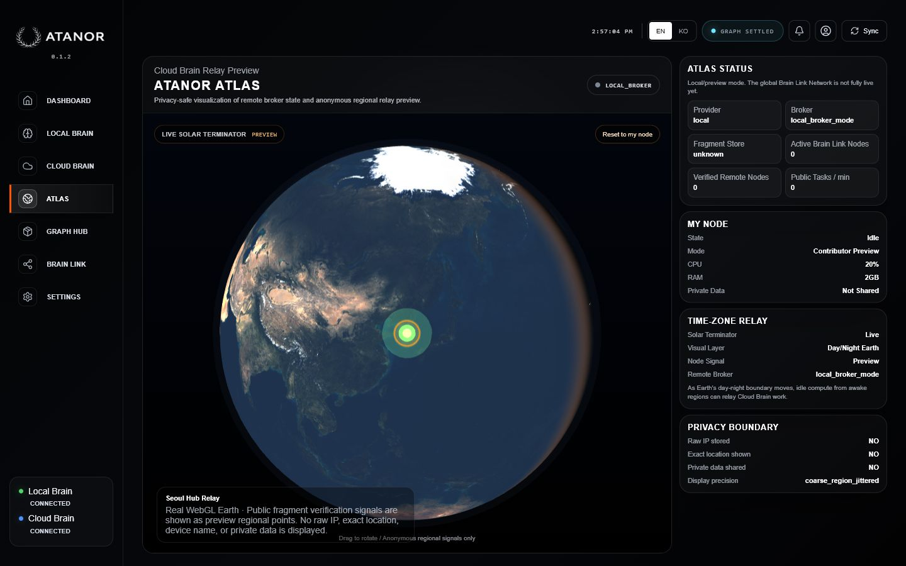
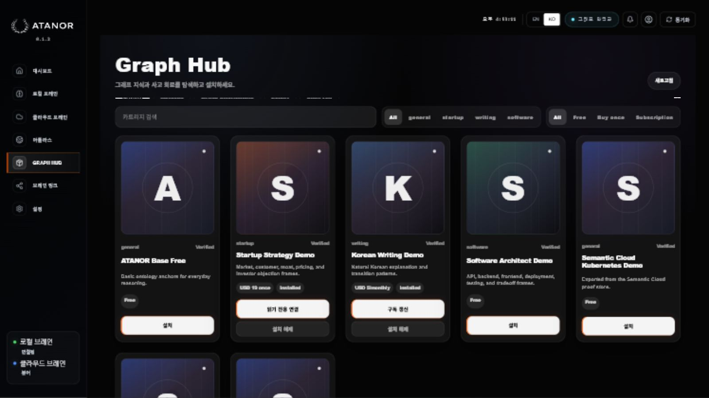
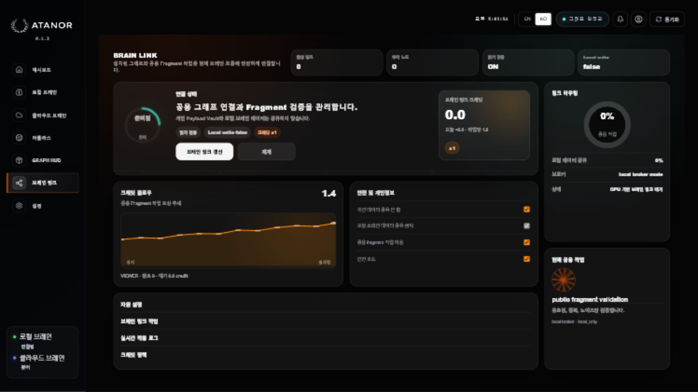
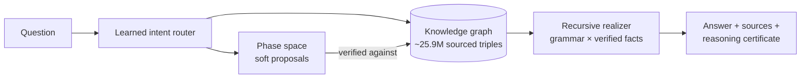

<div align="center">


**출처를 증명하며 답하는, 거대언어모델 없는 그래프 네이티브 AI**
</br>
<em>A graph-native AI that answers without a large language model — every fact stored with its source, every answer synthesized from verified knowledge.</em>

<br/>

<a href="https://atanor-liard.vercel.app" target="_blank"></a>
<a href="https://atanor-liard.vercel.app/#download" target="_blank"></a>
<a href="https://atanor-liard.vercel.app" target="_blank"></a>

<br/><br/>

[](https://github.com/Cozystone/ATANOR-Demo/stargazers)
[](https://github.com/Cozystone/ATANOR-Demo/watchers)
[](https://github.com/Cozystone/ATANOR-Demo/network)
[](LICENSE)
[](#-how-it-works)
[](#-measured-honestly)

[English](#-overview) | [한국어](#-한국어-소개)

</div>

---

## ⚡ Overview

Most AI compresses knowledge into opaque model weights and generates answers
probabilistically — fluent, but unable to prove where a single claim came from.

**ATANOR takes the other road.** Knowledge lives in an explicit knowledge graph
(int-columnar triple store, ~25.9M source-tagged triples). A self-trained
phase-space embedding *proposes* soft matches; the symbolic graph *verifies*
every proposal; a recursive syntactic realizer *composes* the answer from
verified facts only — so a sentence can be **novel** while every fact in it is
a **stored, cited** one. If there is no grounds for an answer, ATANOR says so
instead of inventing one.

> **The design law that runs through every subsystem:**
> propose fast (embeddings, GPU), promote only through verification (evidence, symbols).

### Our Vision

We are not chasing the smartest model. We are building the **most trustworthy
and the lightest** one — an AI whose every answer is auditable, whose private
memory stays on your machine, and that scales through a peer network instead of
a data center.

- **Verifiable** — every answer carries its sources and a reasoning certificate.
- **Local-first** — private memory never leaves your device by default.
- **No-LLM, low-energy** — answers run on CPU; there is no model to download.
- **Decentralized** — Brain Link shards the graph across peers, verify-by-recompute.

## 🌐 Live Demo

Visit **[atanor-liard.vercel.app](https://atanor-liard.vercel.app)** — the landing page
runs a **mini ATANOR entirely inside your browser**: it answers from a curated
knowledge pack with zero server calls, and for anything beyond the pack it
verifies live against the open web (browser → Wikipedia, still no ATANOR
server), quoting the source with a link — or abstaining honestly if nothing
anchors the question.

## 📸 Screenshots

<div align="center">


<sub><b>Atlas</b> — the shared, verified public graph with a privacy-safe global relay view</sub>

<br/><br/>

<table>
<tr>
<td><br/><sub><b>Graph Hub</b> — attach knowledge cartridges read-only</sub></td>
<td><br/><sub><b>Brain Link</b> — peer-to-peer distributed compute</sub></td>
</tr>
</table>
</div>

## 🧠 How It Works



| Layer | What it does |
|---|---|
| **Triple store** (`packages/graph_scale`) | int-columnar s/p/o/src columns = a COO sparse tensor; append-only, tombstone-reversible, every triple source-tagged |
| **Phase space** | self-trained RotatE-style 64-dim embedding — *proposes* nearby concepts, GPU-mirrored (606 MB / 0.25 s for the whole graph) |
| **Symbolic verify** | a proposal survives only if it shares a stated type with the query — soft never becomes truth |
| **Recursive realizer** (`packages/grounded_composer`) | a closed grammar × verified facts → unlimited novel sentences, with a one-line safety proof: output ⊆ closure(grammar ∪ facts) |
| **Brain Link** (`packages/brain_link_pool`) | concept-key sharding + verify-by-recompute + HMAC transport — the trillion-edge plan |

## 📊 Measured, honestly

All numbers are self-measured on our own batteries and reproducible from this
repository; comparisons to LLM figures use public leaderboards with different
test sets, so treat those as directional.

| What | Measured | Note |
|---|---|---|
| Sealed-holdout grounded QA | **92%**, zero fabrication | wrong answers trace to wrong *sources*, not invention |
| Honesty battery | 94% | knows what it doesn't know |
| Multi-hop composition | 75%, zero hallucination | compositional algebra over stated edges |
| Knowledge store | ~25.9M triples | every triple carries a source tag |
| Ingest | 0.96M rows/s (3.0M turbo) | single machine |
| Inference GPU | **none** | answers run on CPU; GPU is for *learning* only |
| Model weights | **0 GB** | there is no language model to download |

> **Honest boundaries:** coverage is narrower than frontier LLMs; arithmetic and
> open-ended creativity are not where graph density helps; uncached facts need
> the (optional) web-learning lane. These are design trade-offs, stated plainly.

## 🚀 Quick Start

**Prerequisites:** Python 3.11+, Node.js 18+.

```bash
# 1) engine
pip install -r requirements.txt
uvicorn app.main:app --app-dir apps/api --port 8502

# 2) web workspace
npm install && npm run dev          # → http://localhost:3000

# 3) tests
python -m pytest packages/graph_scale packages/grounded_composer -q --import-mode=importlib
```

The engine boots with a seed graph; the learning loops grow it from sourced web
evidence behind consensus gates — the **candidate ↔ verified** separation means
new knowledge can never silently overwrite verified knowledge.

## 🗂️ Repository Map

```
apps/
  api/          FastAPI engine (:8502) — answer lanes, learning loops, waitlist
  web/          Next.js workspace UI
  landing/      the public landing page + in-browser mini ATANOR
packages/
  graph_scale/       triple store, GPU mirror, phase space, sense repair
  grounded_composer/ recursive syntactic realizer
  brain_link_pool/   distributed tensor sharding (concept-key + verify-by-recompute)
  cgsr/, answer_quality/, cloud_brain/ ...
deploy/         Docker package for the always-on cloud brain
docs/           architecture contracts, measurements, tech compendium
```

## 📄 License

**Source-available, not open source.** Reading, running, personal evaluation and
contributions are welcome. Commercial use, redistribution of the engine, and
training ML systems on this code require written permission — see [LICENSE](LICENSE).
For commercial licensing, open an issue.

---

## 🇰🇷 한국어 소개

**ATANOR(아타노르)** 는 거대언어모델 없이 답하는 그래프 네이티브 AI입니다.
지식은 출처가 붙은 명시적 지식 그래프(~2,590만 트리플)에 쌓이고, 자체 훈련한
위상 공간이 소프트 매칭을 *제안*하면 기호 그래프가 *검증*하고, 재귀 구문
실현기가 **검증된 사실만으로** 문장을 합성합니다. 문장은 새롭지만, 그 안의
사실은 전부 저장·인용된 것입니다. **근거가 없으면 지어내는 대신 없다고 말합니다.**

<div align="center">

<a href="https://atanor-liard.vercel.app" target="_blank"></a>
<a href="https://atanor-liard.vercel.app/#download" target="_blank"></a>

</div>

- **지금 써보기** — [atanor-liard.vercel.app](https://atanor-liard.vercel.app) 랜딩
  페이지에서 브라우저 안에서만 도는 미니 ATANOR와 대화할 수 있습니다. 팩 안의
  질문은 서버 호출 0으로, 팩 밖의 질문은 브라우저가 직접 웹을 검증해 출처와 함께
  답하고, 앵커할 문서가 없으면 정직하게 기권합니다.
- **정직한 실측** — 봉인 홀드아웃 92%(날조 0), 정직성 94%, 멀티홉 75%. 전부 이
  저장소에서 재현 가능한 자체 측정값입니다. 커버리지가 프런티어 LLM보다 좁은
  것은 설계상의 트레이드오프로, 있는 그대로 공개합니다.
- **왜 다른가** — ① 모든 답에 출처·추론 인증서 ② 개인 기억은 기기 안에(로컬-first)
  ③ 추론에 GPU·모델 가중치 0 ④ Brain Link P2P로 조 단위 확장(검증-재계산).
- **라이선스** — 소스 열람은 가능하지만 오픈소스가 아닙니다. 상업적 이용·재배포·
  코드에 대한 AI 학습은 서면 허가가 필요합니다.

<div align="center">
<br/>

**Own your Intelligence.**

© 2026 Anseok Kim (Cozystone) · [Website](https://atanor-liard.vercel.app) · [LICENSE](LICENSE)

</div>
