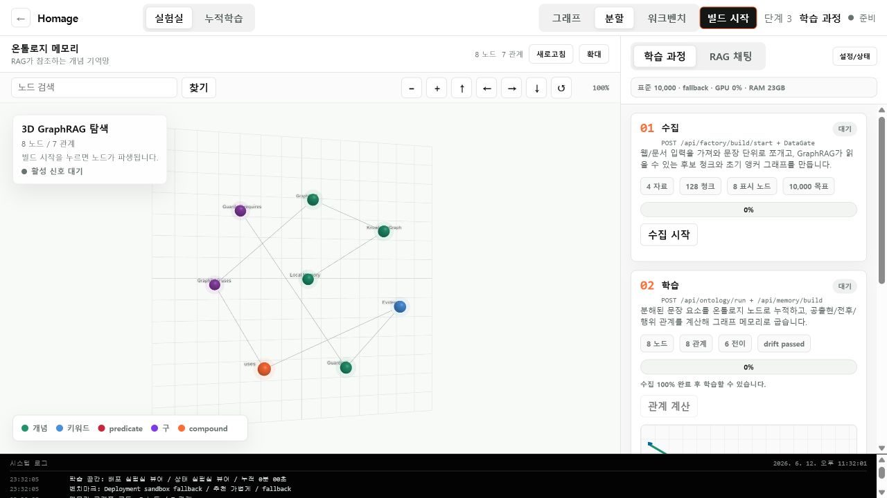
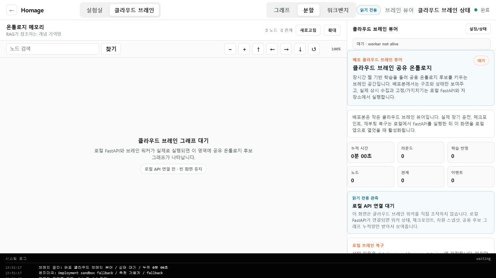

# Homage1.0

**신경망-기호 하이브리드 로컬 AI 엔진 Homage1.0**

Homage1.0 is an Alpha research engine for building a local AI system that keeps
knowledge in an inspectable 3D ontology graph instead of hiding it inside a
giant pretrained model. The current build combines a FastAPI backend, a Next.js
BakeBoard UI, a hardware-adaptive GraphRAG memory layer, and an experimental
Tauri desktop packaging path with a Python sidecar.

[Live Lab Demo](https://homage-alpha.vercel.app) · [Architecture](docs/CLOUD_BRAIN_ARCHITECTURE.md) · [Night Build Log](docs/night_log_0612.md)



## Research Thesis

Homage starts from a simple question: can a personal workstation become more
useful by storing knowledge as an evolving graph, instead of forcing a language
model to memorize everything inside opaque weights?

The target architecture separates the system into two brains:

- **Local Brain:** private, persistent, hardware-adaptive memory on the user's
  own machine.
- **Cloud Brain:** shared public graph fragments that can be queried or copied
  without shipping a giant model around.

The current Alpha does not claim to outperform modern LLMs. It is a transparent
prototype for testing whether graph lookup, synaptic edge weights, pruning,
lazy loading, and a future local syntax assembler can reduce the amount of
brute-force generation needed for useful answers.

한국어로 요약하면, Homage는 지식을 거대 모델 파라미터 안에 억지로 숨기는 대신
3D 온톨로지 그래프에 드러내 놓고, 질문할 때 필요한 하위 그래프만 읽어 자연어
출력으로 조립하려는 신경망-기호 하이브리드 로컬 AI 실험입니다.

## What This Is

Homage is a research attempt to replace part of the brute-force LLM workflow
with a more explicit neuro-symbolic system:

- **Knowledge lives in a graph.** Documents, sentence parts, concepts, and
  relations become ontology nodes and weighted edges.
- **Generation is separated from memorization.** Alpha does not use an external
  LLM to “sound smart.” It exposes a native graph-token prediction path so weak
  memory produces visibly weak output.
- **Learning is cumulative.** Repeated relations potentiate, stale edges decay,
  and pruning keeps local storage from growing without bound.
- **Hardware adapts the workload.** The backend detects RAM/VRAM tiers and
  clamps graph loading limits before queries touch SQLite.
- **Cloud Brain is a graph-fragment layer, not an LLM wrapper.** Shared/public
  knowledge is designed to move as signed graph fragments while private memory
  remains local.

The long-term vision is a workstation-scale AI engine that uses time, local
storage, and graph structure to compensate for not having a massive cloud model
behind every answer.

## Screenshots

### Lab Workspace

The main lab view focuses on a 3D GraphRAG memory map and a right-side process
panel for collection, learning, and output.


### Cloud Brain Viewer

The deployed version acts as a small viewer. Real long-running workers run next
to local FastAPI or a future desktop sidecar.



### Learning Edge Signals

Learning signals are visualized only when a real graph update or activation
event exists. The goal is to show what the engine is actually doing, not a
decorative animation.


### Local Daemon

The Cloud Brain / Hippocampus worker watches local input, checkpoints memory,
and survives reboot through SQLite WAL plus daemon state files.


More UI verification screenshots are available in [docs/screenshots](docs/screenshots).

## Three-Step Flow

Homage is intentionally organized around three visible stages:

| Stage | Purpose | What the UI should reveal |
| --- | --- | --- |
| 1. Collect | Ingest web/local text, split sentences, filter noisy inputs | source count, chunks, DataGate pass/fail |
| 2. Learn | Build ontology concepts, calculate relation weights, checkpoint memory | new nodes, reinforced edges, pruning/decay |
| 3. Output | Retrieve active graph context and attempt a native answer | activated nodes, confidence, evidence/graph path |

This is why the lab view shows the graph and the process panel together. When a
node or edge lights up, it should correspond to an actual retrieval, insertion,
or learning event rather than a decorative animation.

## Architecture

```text
User question / local document
        |
        v
Harvest + DataGate
  collect, clean, filter, deduplicate
        |
        v
Ontology Forge
  contextual entity resolution
  UUID concept nodes
  concept_id -> concept_id edges
        |
        v
Knowledge Bakery / Local Brain
  SQLite WAL
  token transitions
  relation stats
  synaptic weights
  checkpointed daemon state
        |
        v
GraphRAG + Native Graph Token Predictor
  lazy subgraph retrieval
  active-node signals
  graph-token answer attempt
        |
        v
Guard / Drift / Stability
  evidence checks
  graph health
  resource limits
```

## Core Modules

| Area | Path | Status |
| --- | --- | --- |
| FastAPI backend | `apps/api` | Alpha APIs, local telemetry, RAG, daemon control |
| Next.js UI | `apps/web` | BakeBoard lab, Cloud Brain viewer, 3D GraphRAG |
| DataGate | `packages/datagate` | deterministic source filtering |
| Ontology Forge | `packages/ontology_forge` | contextual entity resolution and UUID concept schema |
| Knowledge Bakery | `packages/knowledge_bakery` | local memory DB, daemon, potentiation/decay |
| RAG Engine | `packages/rag_engine` | lazy graph loading, fusion, native utterance |
| Neuro Efficiency | `packages/neuro_efficiency` | benchmark, hardware tier adapter, stability planning |
| Desktop shell | `src-tauri` | Tauri scaffold with Python sidecar lifecycle |

## Current Alpha Capabilities

- 3D GraphRAG dashboard with zoom, pan, graph controls, and large-graph
  rendering through `THREE.Points`, `InstancedMesh`, and `LineSegments`.
- Sequential lab flow: collection, learning, output.
- Local FastAPI connection for real PC telemetry and benchmark-based workload
  tuning.
- Hardware-adaptive lazy subgraph retrieval:
  - Target: 32GB RAM + 12GB+ VRAM
  - Baseline: 16GB RAM
  - Minimum: under 16GB RAM
- Continuous local learner:
  - watches `data/raw`
  - moves files into `data/cleaned`
  - extracts ontology concepts and relations
  - reinforces repeated edges
  - applies decay/pruning
  - checkpoints state
- Hybrid network manager:
  - Supabase metadata-only signaling facade
  - P2P-ready graph fragment transport interface
  - signed HTTP fragment fallback
  - SHA256 payload validation before fragment ingestion
- Desktop packaging scaffold:
  - PyInstaller FastAPI sidecar
  - Tauri Rust lifecycle controller
  - AppData-safe persistent data paths
  - frontend updater hook and modal

## What It Is Not Yet

Homage Alpha is not a finished replacement for ChatGPT, Claude, Llama, or other
modern LLMs. It is a transparent research scaffold. The answer quality will be
rough when the graph is weak, because the project intentionally avoids hiding
weak reasoning behind a polished external LLM.

The independent local syntax assembler / decoder is still a future research
track. Current generation is an Alpha graph-token prediction path.

## Quick Start

### 1. Backend

```powershell
python -m venv .venv
.venv\Scripts\activate
pip install -r apps/api/requirements.txt
pip install -e "packages/datagate[dev]"
pip install -e "packages/ontology_forge[dev]"
pip install -e "packages/rag_engine[dev]"
pip install -e "packages/guard[dev]"
pip install -e "packages/model[dev]"
pip install -e "packages/trainer[dev]"
pip install -e "packages/neuro_efficiency[dev]"
pip install -e "packages/knowledge_bakery[dev]"
python -m uvicorn app.main:app --reload --host 127.0.0.1 --port 8000 --app-dir apps/api
```

### 2. Frontend

```powershell
npm install
npm --workspace apps/web run dev
```

Open [http://localhost:3000](http://localhost:3000).

The hosted demo works without local setup, but real hardware measurement and
long-running learning require local FastAPI.

## Local Learning

Drop `.txt` or `.md` files into `data/raw`, then start the daemon:

```powershell
Invoke-RestMethod -Method Post http://127.0.0.1:8000/api/learning/daemon/start
```

The daemon persists state in:

```text
data/memory/homage.db
data/memory/events.jsonl
data/memory/daemon_state.json
data/memory/daemon_checkpoints/
data/memory/canonical_concepts.sqlite3
```

If the PC reboots, restart FastAPI and call:

```powershell
Invoke-RestMethod -Method Post http://127.0.0.1:8000/api/learning/daemon/resume
```

## Desktop App Status

The repo now includes a Tauri desktop scaffold and a compiled Python sidecar
build path.

```powershell
npm run desktop:sidecar
npm --workspace apps/web run build:desktop
npm run tauri -- build
```

Current local build note:

- FastAPI sidecar was generated successfully at
  `src-tauri/binaries/homage-api-x86_64-pc-windows-msvc.exe`.
- `npm run tauri -- build` currently fails on this machine because Windows
  Application Control Policy blocks Cargo build-script execution with
  `os error 4551`.
- Building on a trusted Rust/Tauri machine or CI runner should be the next
  packaging step.

GitHub Actions workflow:

- `.github/workflows/desktop-build.yml` builds Windows and macOS bundles.
- Trigger it manually from the Actions tab or push a `v*` tag.
- Add `TAURI_SIGNING_PRIVATE_KEY` and
  `TAURI_SIGNING_PRIVATE_KEY_PASSWORD` repository secrets before producing
  updater artifacts for public release.
- If the signing key is missing, CI disables updater artifact generation for
  that run and still attempts to produce ordinary desktop installers.
- Built installers are uploaded as workflow artifacts under
  `src-tauri/target/release/bundle`.

## Suggested GitHub About

Description:

```text
신경망-기호 하이브리드 로컬 AI 엔진 Homage1.0
```

Topics:

```text
neuro-symbolic-ai, graphrag, knowledge-graph, local-ai, fastapi, nextjs, tauri,
threejs, continual-learning, ontology
```

## Verification

Useful checks:

```powershell
$env:PYTHONPATH='apps/api;packages/rag_engine;packages/guard;packages/ontology_forge;packages/datagate;packages/knowledge_bakery;packages/neuro_efficiency;packages/trainer;packages/model'
python -m pytest apps/api/tests/test_hybrid_network_manager.py apps/api/tests/test_desktop_paths.py packages/neuro_efficiency/tests/test_hardware_adapter.py packages/rag_engine/tests/test_graph_store.py -q
npm --workspace apps/web run build
npm --workspace apps/web run build:desktop
```

## License / Research Notice

This is an Alpha research repository. APIs, storage schema, and UI behavior may
change quickly while the architecture is being tested.
